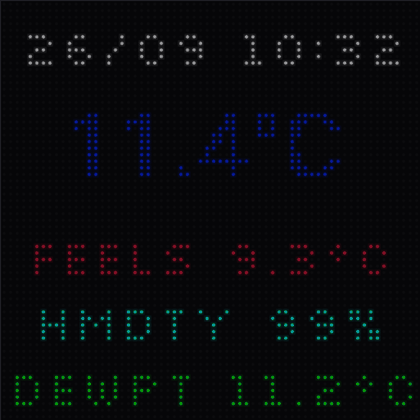
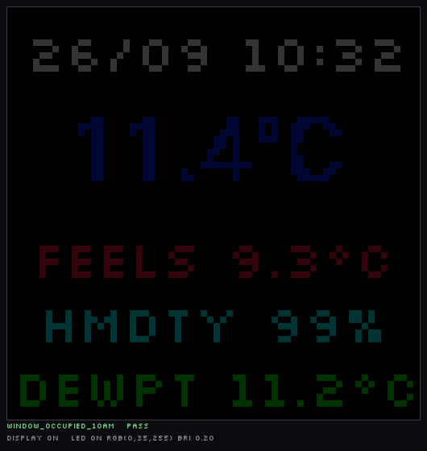
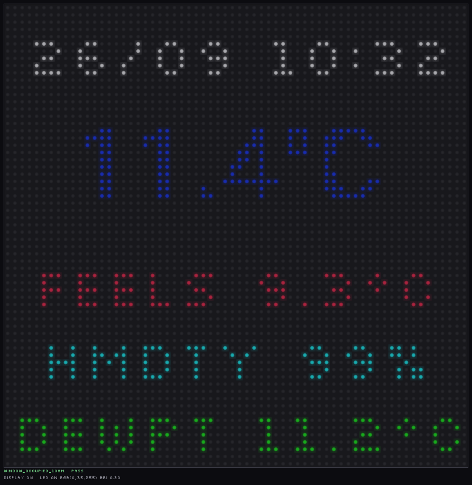
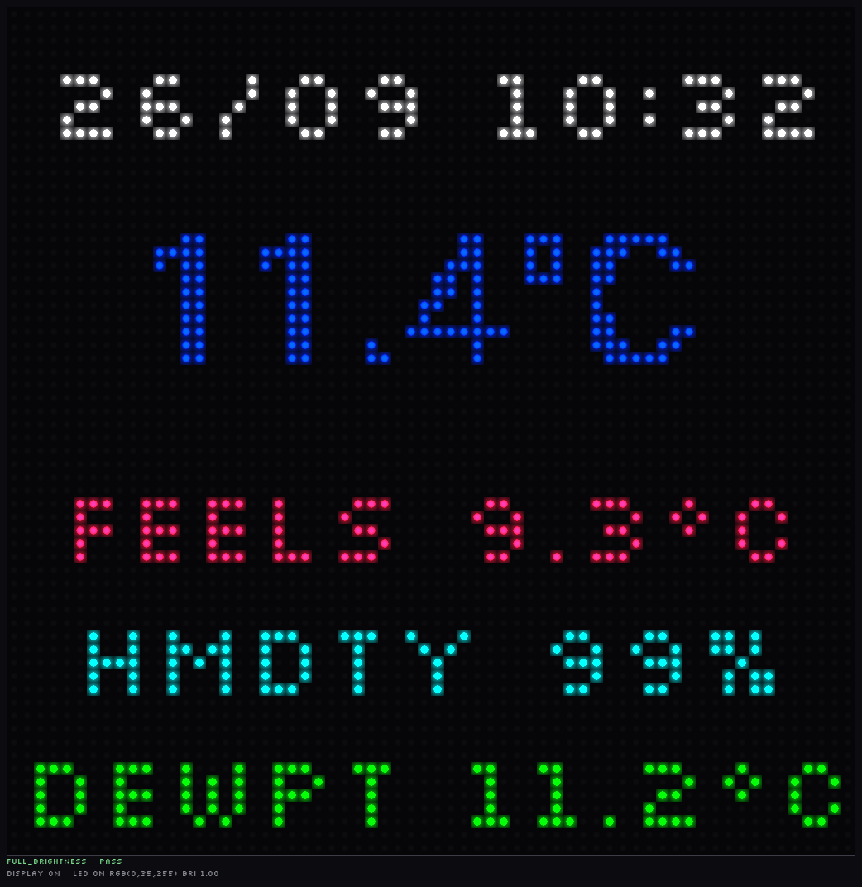
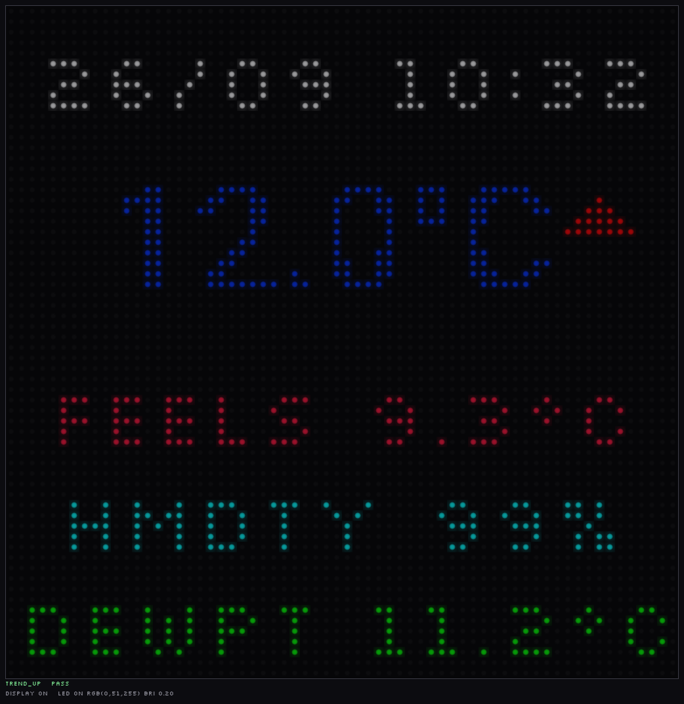
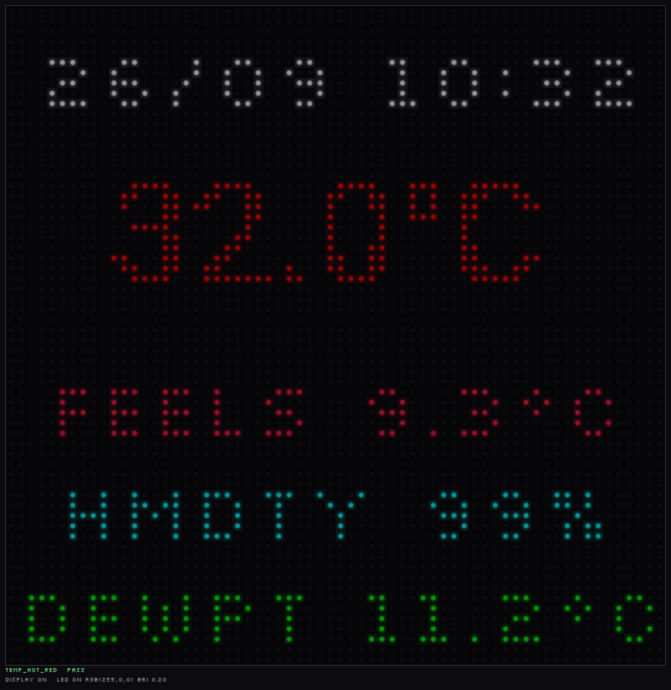
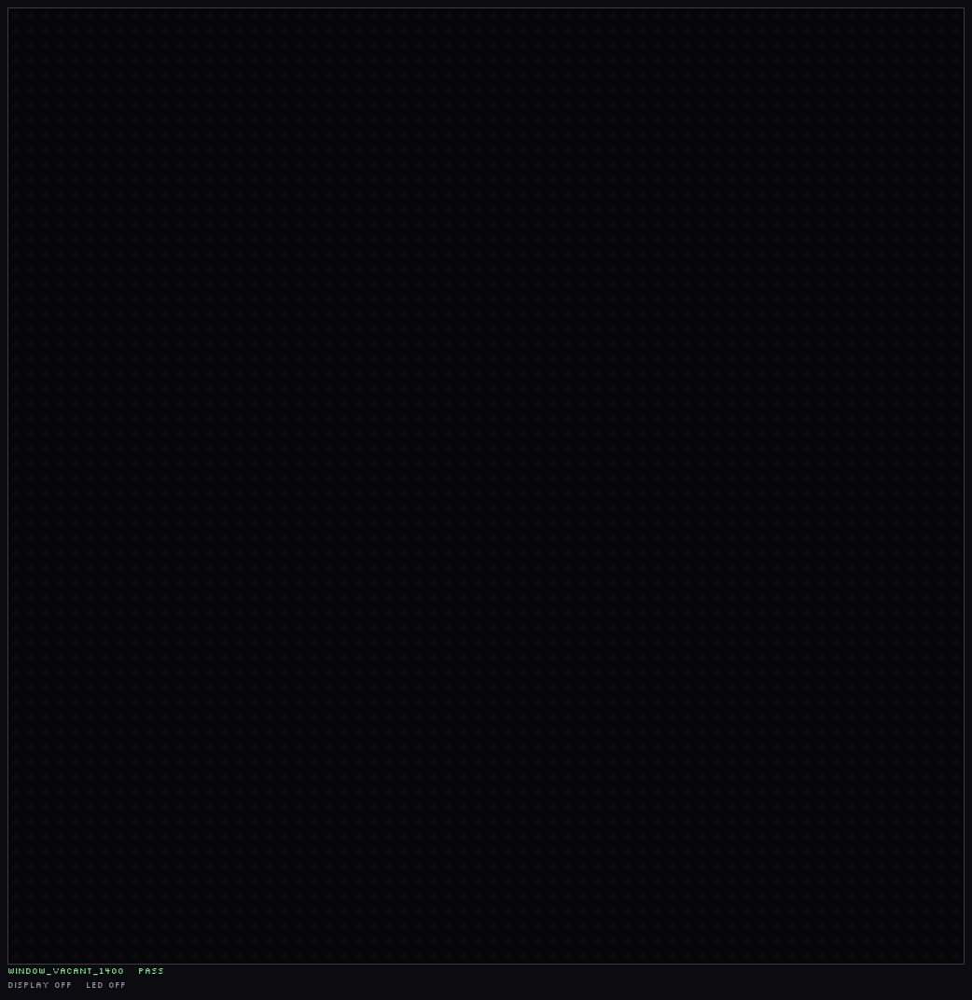

# ApolloMatrix

| How it looks — device preview | How it is — the faithful 64×64 grid |
|---|---|
|  |  |

*Both rendered by the host test harness, not photographed. The animation walks through
the everyday frame at brightness 0.2, full brightness, a rising trend arrow, the red end
of the colour ramp, and the blanked state — [more states
below](#what-it-looks-like).*

ESPHome configuration for an **Apollo Automation M-1** 64×64 HUB75 LED matrix
panel driven by an **ESP32-S3** (DevKitC-1). The panel shows the date/time and
live weather, colour-coded by temperature, with a 30-minute trend arrow. It only
lights up within an 08:00–22:00 window while its room is occupied — or on the time
window alone if you have no presence sensor — and can be forced on from Home
Assistant.

Weather comes from **Home Assistant entities** (the default config points at a
Bureau-of-Meteorology station in Scoresby, Melbourne) — see
[Configuration](#configuration) to swap in your own source and location.

> **Just got the hardware? Start with the [User Guide](docs/USER_GUIDE.md)** — it walks
> through collecting your entity IDs, editing the config, the first USB flash, adding
> the device to Home Assistant and troubleshooting. The rest of this README is the
> project reference.

## Configuration

Everything you need to change is in the **`substitutions:`** block at the top of
`ApolloMatrix.yaml`. The rest of the file is the engine and reads it via `${...}`.

It is deliberately a **single self-contained file** — the only YAML you copy to the
ESPHome addon. Optional features (like time-based-only operation) appear as commented
alternative blocks in the same file rather than extra files to copy.

| Substitution | Default | What it does |
|---|---|---|
| `weather_temp` | `sensor.scoresby_temp` | Outside temperature — **in °C** |
| `weather_feels_like` | `sensor.scoresby_temp_feels_like` | Apparent temperature (°C) |
| `weather_humidity` | `sensor.scoresby_humidity` | Relative humidity (%) |
| `weather_dew_point` | `sensor.scoresby_dew_point` | Dew point (°C) |
| `presence_sensor` | `binary_sensor.sonoff_snzb_06p24` | Occupancy sensor for the panel's room. Optional — see *time-based only* below |
| `timezone` | `Australia/Melbourne` | Drives the clock *and* the visibility window |
| `start_hour` | `8` | Window opens (inclusive) |
| `off_hour` | `22` | Window closes (exclusive), and the manual override resets |
| `device_name` | `apollomatrix` | Hostname — lowercase letters, digits and dashes only |
| `device_friendly_name` | `ApolloMatrix` | The name Home Assistant shows |
| `panel_width` / `panel_height` | `64` / `64` | Panel size in pixels |
| `shift_driver` | `FM6126A` | Panel shift-register chip |
| `bit_depth` | `10` | Colour bit depth |
| `gate_pin`, `r1_pin` … `oe_pin` | see file | Wiring — change only if you rewired it |

Any Home Assistant weather source works (BOM, Met.no, Weather Underground, your own
station) — it just has to expose those four quantities **in °C**. The colour ramp
(−2 … 30 °C), the trend threshold (±0.1 °C) and the formats are all Celsius: if your
entities report °F, add a `template` sensor converting to °C and point the
substitution at that, rather than re-scaling the ramp in three places.

Two things to know before you change any *text*:

- **Every character you display must be in that font's `glyphs:` list**, and glyph
  bitmaps are baked at build time. A missing character renders as a filled rectangle
  (that is how the old `-` bug appeared). Change a unit letter or a label and you must
  extend `glyphs:` and re-run `python test/export_font_metrics.py`.
- **Longer text may not fit.** `DEWPT 11.2°C` is 62 of the 64 px. Run
  `test/run_tests.sh` and look at the crisp renders — the harness doubles as a fit
  check.

### Time-based only (no presence sensor)

In `ApolloMatrix.yaml`, delete the active **Option A** block under
`# ── Presence gate ──` and uncomment **Option B** immediately below it. Option B is a
`template` sensor that reports permanently occupied, so the visibility window alone
decides when the panel is lit and you need no presence entity at all. Everything else
is unchanged — including the manual override still respecting the cutoff.

## Hardware

| Item | Value |
|---|---|
| MCU | ESP32-S3 (esp32-s3-devkitc-1), ESP-IDF framework |
| Panel | 64×64 HUB75, shift driver `FM6126A`, `STANDARD_TWO_SCAN`, 10-bit depth |
| Power gate | GPIO7 (`onboard_power_gate`) |

HUB75 pins: `R1=42 G1=41 B1=40 R2=38 G2=39 B2=37 A=45 B=36 C=48 D=35 E=21 CLK=2 LAT=47 OE=14`.

## What it displays

- **Date/time** `%d/%m %H:%M` at a fixed position (the old ±1.5 px burn-in drift was removed — see `docs/lessons/` 21).
- **Temperature** from `sensor.scoresby_temp`, interpolated white→blue→cyan→green→orange→red across −2 °C … 30 °C.
- **Trend arrow** ▲/▼ comparing the current temperature against the 30-minute anchor (`temp_30m`), which is rotated by the `update_temp_trend` script every 10 min.
- **FEELS / HMDTY / DEWPT** lines from the matching Scoresby sensors.

### Visibility window

Shown when the room is occupied **and** the time is within the window:

- hour ≥ `${start_hour}` (08:00) and < `${off_hour}` (22:00), and
- `${presence_sensor}` reports presence — with `presence/none.yaml` this is always
  true, giving a time-only schedule

or when **manual override** is on and hour < 22:00 (overrides both the presence
gate and the 08:00 start, but still blanks at the cutoff).

At 22:00 the `manual_override` is reset and the matrix blanks.

## What it looks like

Snapshots from the host harness — including the animated hero at the top. To refresh
them: `test/run_tests.sh` then `python test/make_readme_images.py` (which also rebuilds
the GIF).

| Render | State |
|---|---|
|  | **In window, room occupied** — the everyday frame at brightness 0.2 |
|  | **Brightness 1.0** — the same frame with `number.apollomatrix_matrix_brightness` at full; every colour is scaled by it |
|  | **Trend arrow** — temperature above its 30-minute anchor (▲ red; below the anchor, ▼ blue) |
|  | **Colour ramp** — 32 °C, the red end. The ramp runs white → blue → cyan → green → orange → red across −2 °C … 30 °C |
|  | **Blanked** — outside 08:00–22:00, room empty, or the presence sensor has no state: the panel clears |
|  | **The faithful view** — the same everyday frame as the 64×64 grid the panel actually receives, with no glow or LED styling |

The first five are the `device` style — a presentation render of how the panel
*looks*. The last is the `crisp` style — how it *is*; only that one should be used to
judge layout, margins and clipping.

## Home Assistant entities

| Entity | Type | Purpose |
|---|---|---|
| `number.apollomatrix_matrix_brightness` | number | Matrix brightness 0.1–1.0 (restored) |
| `switch.apollomatrix_matrix_toggle` | switch | Manual override — force the display on |
| `binary_sensor.sonoff_snzb_06p24` | binary_sensor | Room presence gate (from HA) |

There is **no** `update.apollomatrix_firmware` entity and no `update:` platform
in the config — OTA updates are triggered from the ESPHome dashboard, not HA.

## Requirements

- **ESPHome** with the `hub75` display platform. The `esp-hub75` component
  (v0.3.5) is pulled automatically via the ESP-IDF component manager
  (`idf_component.yml` in the generated build) — **no `external_components:`
  block is needed**.
- Fonts are fetched at build time from Google Fonts (`gfonts://Silkscreen`, `gfonts://Roboto`).

## Build / flash (ESPHome addon on the HA server)

**First time with new hardware? Use the [User Guide](docs/USER_GUIDE.md)** — the first
flash must be over USB, which this section does not cover.

Firmware is built and pushed from the **ESPHome addon on the Home Assistant
server**, not from this repo's machine.

1. Edit the `substitutions:` block at the top of `ApolloMatrix.yaml` — your weather
   entities, presence entity, timezone and window (see
   [Configuration](#configuration)).
2. Copy `ApolloMatrix.yaml` into the addon's config dir on the HA host, e.g.
   `/config/esphome/ApolloMatrix.yaml`. The addon already has `secrets.yaml` with the
   WiFi credentials (`!secret wifi_ssid` / `!secret wifi_password`); this repo's
   `secrets.yaml` is deliberately absent (git-ignored).
   ⚠️ Copy the file from disk — don't paste it through chat: runs of 10+ digits get
   redacted to `[PHONE]`, which corrupts the font `glyphs` lines.
3. In the ESPHome dashboard: select **ApolloMatrix** → ⋮ → **Install** →
   **Wirelessly** (OTA). The addon compiles (fetches the two Google fonts, resolves
   `esp-hub75`) and flashes over Wi-Fi.

`cp secrets.yaml.example secrets.yaml` is only needed if you build with the CLI
from a different host.

### Local validation (this repo)

- `python -m esphome config ApolloMatrix.yaml` validates schema and fetches the
  fonts — works from here and is a good first check. It needs a `secrets.yaml`;
  run it from a scratch copy with dummy WiFi creds so real ones never enter the
  repo.
- **Version skew is real, but nothing in this config triggers it.** The local CLI is
  ESPHome 2026.7.4 and validates this config cleanly; the add-on on the HA server is
  at least 2026.8 (it once offered the `channel_colors` migration for the light block,
  since removed). If you add an option newer than the local CLI, `esphome config` will
  call it invalid *here* — treat that as version skew, not a config error, and trust
  the add-on's build.
- **Do not trust `python -m esphome compile` in this git-bash/MSYS
  environment** — ESP-IDF refuses to build there and ESPHome prints
  `Successfully compiled program` even when no `.elf`/`.bin` is produced.
  Inspect `.esphome/build/apollomatrix/src/main.cpp` for the translated logic,
  and build on the addon host (details in `docs/lessons/`).

## Testing (host render harness)

`test/` compiles the display logic on the PC and renders what the 64×64 panel
would show — no ESP-IDF, no flashing.

```bash
test/run_tests.sh
```

Four steps:

1. **Build** `test/main.cpp` (CMake + Ninja, host g++) with the ported display
   logic in `test/matrix_logic.h`.
2. **Logic sync check** (`test/check_sync.py`) — asserts the load-bearing
   expressions (gating conditions, trend thresholds, text formats, layout anchors)
   still match between `ApolloMatrix.yaml` and `test/matrix_logic.h`.
3. **Font fixtures check** (`test/export_font_metrics.py --check`) — asserts
   `test/fonts/metrics.json` still matches the YAML `font:` blocks (glyph set, size,
   bpp), so the render cannot silently keep using a stale font.
4. **Run 20 scenarios** asserting the expected display/LED state, then rasterize
   each to PNG.

Two styles are rendered for every scenario, into one directory (`test/output/images/`),
prefixed by style:

- **crisp_** — the faithful 64×64 pixel grid at 8× zoom. Use this to judge layout and
  content.
- **device_** — an LED-panel look: round LEDs with a glow halo on a dark mask and
  faint unlit packages between them. Deliberately **uniform** — no per-LED brightness
  spread and no vignette, so every LED of the same colour renders identically.
  Presentation only — `--exposure` is a gain on the LEDs' emitted light (it does not
  touch the panel background), default `2.2` for a dark-room-photo look and `1.0` for
  the true brightness. Use this to judge how it will *appear*.

Each style also gets a `<style>_contact_sheet.png`. Knobs:
`rasterize.py [traces_dir] [out_dir] --style crisp|device --cell 16 --exposure 2.2`.

Coverage: window boundaries (07:30 / 08:00 / 21:59 / 22:00), room occupied vs
empty, presence sensor with no state, manual override inside/outside the window and
past the cutoff, the temperature colour ramp (1 / 6 / 32 °C), a sub-zero reading,
trend up/down/flat, brightness 0.2 vs 1.0, and missing HA sensor data.

### Rendering fidelity

The PNGs are rendered from the device's own font data rather than an approximation.
`test/fonts/metrics.json` is ESPHome's font output — FreeType advances/offsets plus
`bpp`-bit coverage — produced by `test/export_font_metrics.py`, which drives
ESPHome's own glyph generator. It is verified **byte-for-byte** against a real build:

```bash
python test/export_font_metrics.py --verify <build>/src/main.cpp
```

`rasterize.py` then applies the firmware's rendering rules: `x1 = x - (width +
x_offset)/2`, `y1 = y - height/2` (CENTER centres vertically too), one pen step per
glyph advance, and every pixel with coverage > 0 drawn at the full text colour.

**The panel does not antialias.** ESPHome *does* blend partial coverage, but a
LED-by-LED measurement of a photo of the device shows every inked pixel at identical
brightness — medians 146 / 146 / 146 for coverage 1 / 2 / 3 against a background of
66 — and the ink shape matches "coverage > 0" (IoU 0.86) rather than a 50% threshold
(0.61) or full coverage only (0.45). So `bpp` decides *which* pixels are inked, not
how bright they are, and the renderer thresholds coverage the same way. An unknown
codepoint would draw `Font::print()`'s placeholder rectangle; the renderer models
that too, but the glyph sets no longer need it.

**`test/matrix_logic.h` is a copy** of the YAML lambda — `ApolloMatrix.yaml` stays
the source of truth for the device. Changes must be mirrored in both; the sync
check catches most drift.

The two preview fonts are **not** distributed with this repo (third-party font
software). Fetch them when you want the caption chrome or need to re-export the glyph
fixtures:

```bash
python test/fetch_fonts.py --download      # simplest, no ESPHome needed
python test/fetch_fonts.py --via-esphome   # byte-identical to the firmware
```

Renders still work without them — `metrics.json` is committed and the caption font
falls back. See `test/fonts/NOTICE.txt` for the licences. The firmware build never
reads that directory: ESPHome fetches `gfonts://` itself.

## Known issues / TODO

- **The onboard status LED was removed (2026-09-26).** The config used to drive a WS2812
  on `GPIO3` (`esp32_rmt_led_strip`) with a "Heartbeat" pulse, tinted to the temperature.
  Forcing a manual override with the matrix at full brightness lit the panel but **never
  lit anything on the board**, so the pin/chipset assumption does not match this
  hardware (`GPIO3` is a strapping pin here). The `light:` block, its two lambda calls,
  the `status_led_pin` substitution and the `light.apollomatrix_onboard_status_led`
  entity are all gone; the code is in git history if the correct pin turns up. There is
  therefore no remote "is the display lit?" signal — see lesson 3.

- **A weather change will not wake the display.** An earlier version of this config had
  a `weather_condition` text sensor plus a `show_weather_timer` script meant to force
  the display on for 60 s. It never worked (`display_active` was written but never
  read), the entity it referenced did not exist on HA, and the whole path has been
  **removed**, along with the unused `last_weather` and `global_brightness` globals.
  If weather alerts should wake the screen, that is new behaviour to design — not a
  bug to fix.
- **No `update:` platform** — there is no `update.apollomatrix_firmware` HA
  entity; OTA is via the ESPHome dashboard.
